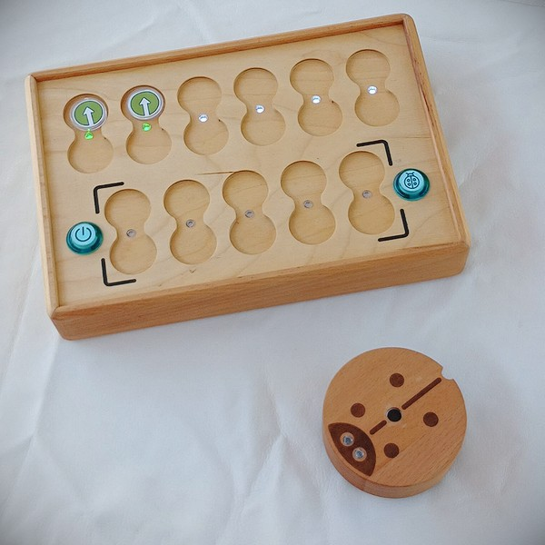
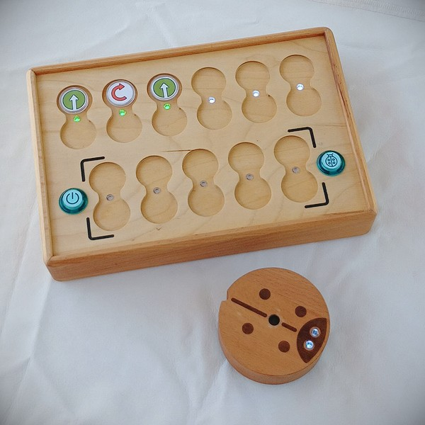
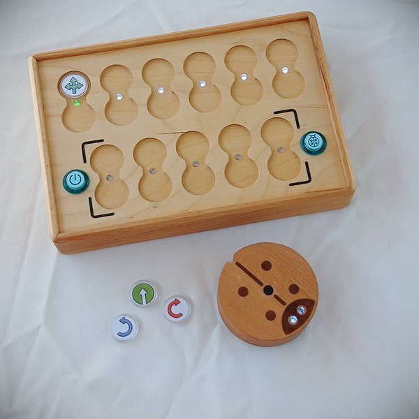
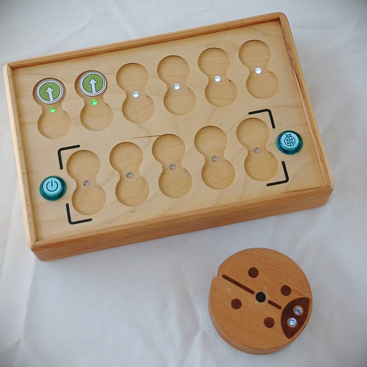
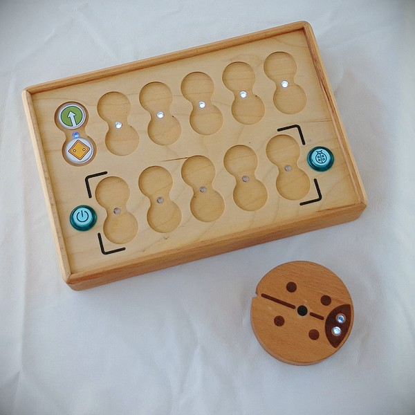
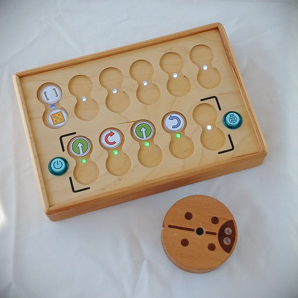
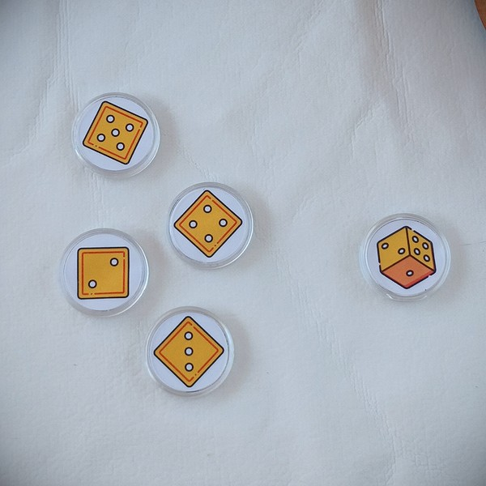
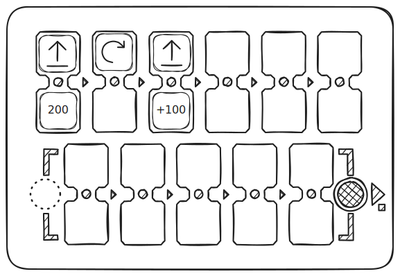

# Guide de l'enseignant.

Nous, créateurs de PrimaSTEM, vous présentons un kit éducatif en développement, conçu pour enseigner la logique, la programmation et les mathématiques aux enfants de manière ludique.

PrimaSTEM est un jouet pédagogique destiné aux enfants de 4 à 10 ans, leur permettant d’apprendre à programmer un robot sympathique sans utiliser d'ordinateur, de tablette ou de téléphone. 

Ce processus, habituellement complexe, est présenté ici de manière simple et tactile, accessible même aux plus jeunes. En jouant, les enfants découvrent les bases de la programmation, de la logique et des mathématiques.

PrimaSTEM peut être utilisé dans de nombreuses matières scolaires et préscolaires telles que les mathématiques, la géographie, ainsi que dans des activités périscolaires. Ce kit est universel !

En jouant avec PrimaSTEM, les enfants développent des compétences dans plusieurs domaines clés, tels que la pensée logique, les algorithmes, la programmation, les mathématiques, la géométrie, ainsi que la créativité et les compétences socio-affectives.

PrimaSTEM est une première étape avant d’introduire les enfants à la programmation informatique avec des langages visuels comme [Scratch](https://en.wikipedia.org/wiki/Scratch_(programming_language)) ou [LOGO](https://en.wikipedia.org/wiki/Logo_(programming_language)).

## Familiarisation avec le kit

### Où utiliser le kit PrimaSTEM ?

Voici quelques exemples de lieux et de programmes éducatifs où PrimaSTEM peut être utilisé pour enseigner les bases de la logique et de la programmation à travers des jeux tactiles :

- Centres préscolaires

- Jardins d'enfants (méthodes Montessori)

- Écoles primaires

- Enseignement à domicile

- Centres d'éducation spécialisée

- Activités périscolaires

- Clubs de programmation élémentaire

- Camps éducatifs d'été

### Comment commencer ?

Avant d'utiliser le kit avec les enfants, nous recommandons aux enseignants de lire le manuel d'utilisation. Aucune compétence particulière en programmation n’est nécessaire pour enseigner avec PrimaSTEM. Ce guide vous fournira les bases nécessaires pour commencer.

## Inspirations et approche pédagogique

PrimaSTEM s’inspire du langage de programmation [LOGO](https://en.wikipedia.org/wiki/Logo_(programming_language)), conçu par [Seymour Papert](https://en.wikipedia.org/wiki/Seymour_Papert) dans les années 1960, ainsi que de la pédagogie Montessori. Le langage LOGO et sa tortue-robot ont permis d’introduire la programmation de manière accessible aux enfants, tout en leur offrant la possibilité de découvrir leur propre manière de résoudre des problèmes.

Les **puces de commande** de PrimaSTEM simplifient cette approche. Ici, les commandes sont tactiles et ne nécessitent pas d’écrans ni de texte, ce qui rend l’apprentissage plus intuitif pour les jeunes enfants.

En observant le comportement du robot, vous pouvez facilement voir la signification de chaque commande et ainsi maîtriser non seulement les outils du langage de programmation, mais aussi apprendre facilement les algorithmes.

Le robot a une qualité importante : il a une direction, ce qui permet à l'enfant de s'identifier à lui et de comprendre plus facilement la logique de base des programmes.

Les premières commandes sont très simples : elles indiquent dans quelle direction le robot doit se déplacer. Apprendre à un robot à "agir" ou à "penser" oblige les enfants à réfléchir à leurs propres actions et pensées, de sorte que l'apprentissage du codage devient plus efficace.

Les puces de commande PrimaSTEM peuvent être considérées comme une simplification du langage LOGO. Nous avons limité les instructions de base à leur forme la plus simple, en évitant tout langage textuel ou numérique au début de la formation.

### Pourquoi un matériau naturel ?

Le choix du bois pour la télécommande et le robot n’est pas anodin. Après observation dans des jardins d’enfants, nous avons constaté que les enfants préfèrent les jouets en bois, qui sont plus agréables à manipuler et qui se marquent avec le temps, créant ainsi une sorte d’histoire propre à chaque jouet.

## Concepts de programmation avec PrimaSTEM

Les puces de commande tangibles de PrimaSTEM sont des analogues physiques aux instructions que l’on retrouve dans les langages de programmation. À travers le jeu, les enfants apprennent plusieurs concepts-clés :

### Algorithmes

Un **algorithme** est une série d’instructions précises qui, ensemble, forment un programme. Les puces de PrimaSTEM représentent ces instructions.

### File d'attente

Les instructions sont exécutées dans l'ordre dans lequel elles sont placées sur la télécommande, de gauche à droite.

### Débogage

Si une erreur se produit et que le robot ne va pas là où il est censé aller, il suffit de modifier une puce sur la télécommande. Cela enseigne aux enfants la correction d'erreurs (ou **débogage**).

### Fonction

Une **fonction** est un ensemble d'instructions qui peut être réutilisé dans le programme. Avec PrimaSTEM, les enfants peuvent créer des sous-programmes en utilisant la puce orange "Fonction" et les appeler quand nécessaire.

## Application dans d'autres matières

PrimaSTEM ne se limite pas à la programmation, il peut également être utilisé pour enseigner d'autres matières, telles que:

- **Communication** : Le jeu en groupe favorise l'entraide et la collaboration.
- **Coordination et motricité** : En manipulant les puces et en interagissant avec le robot, les enfants améliorent leur coordination et leur motricité fine.
- **Développement socio-émotionnel** : Les enfants gagnent en confiance en essayant de nouvelles activités et en résolvant des problèmes ensemble.
- **Mathématiques** : PrimaSTEM permet de renforcer des notions mathématiques simples comme le comptage, la distance et les probabilités.
- **Pensée logique** : En programmant le robot, les enfants développent leur capacité à organiser des séquences et à anticiper des actions.

Lorsque l'enfant reçoit une tâche ou élabore son propre plan, il crée une chaîne séquentielle de puces de commande avec ses mains et les ressent tactilement. Après avoir appuyé sur le bouton "**Exécuter**", le robot se déplace et l'enfant voit les résultats de son code de programmation. Il en tire des conclusions pour savoir s'il a dirigé le robot correctement, si le résultat correspond à sa pensée initiale. De cette manière, un processus engage la perception tactile, visuelle et mentale de l'enfant dans le jeu - l'apprentissage.

## Présentation du robot et de la télécommande

### Le robot

Présentez le robot aux enfants comme un ami qu'ils peuvent programmer. Expliquez-leur que le robot ne peut pas penser par lui-même et qu’il a besoin de leurs instructions pour se déplacer. Cela aide les enfants à comprendre que le robot, tout comme d’autres objets dans la maison (télévisions, machines à laver), nécessite une intervention humaine pour fonctionner.

### La télécommande

Expliquez que la télécommande sert à envoyer des commandes au robot. Sans elle, le robot ne peut pas bouger. Montrez aux enfants comment insérer les puces et utiliser les commandes pour programmer le robot.

> Pour créer la partie principale du programme du robot, seule la ligne supérieure du panneau de commande est utilisée (6 cellules pour les commandes et les cellules inférieures pour les valeurs). Les cellules du bas de la télécommande (5 cellules pour les commandes et les cellules en dessous pour les valeurs) sont destinées à un sous-programme et sont activées lors de l'utilisation de la commande "**Fonction**".

### Familiarité avec les puces -commandes de contrôle

Les puces sont des instructions pour le robot qui sont insérées dans la télécommande. Lorsque le bouton est enfoncé, le robot exécute le programme. Chaque puce est une commande claire et sans ambiguïté qui aide les enfants à développer leurs capacités de réflexion informatique. Il est important que les enfants comprennent ce que fait le robot lorsque chaque commande est activée. Cela leur apprend à concevoir des programmes et à prédire les actions du robot. Expliquez également aux enfants que les puces ne doivent pas être perdues, endommagées ou mouillées, car sans elles, le robot ne pourra pas exécuter correctement les commandes.

## Gameplay - Partie 1 (niveau d'entrée)

### Cause et effet

L'objectif de la première leçon est d'introduire le concept simple selon lequel l'envoi d'une commande au robot entraîne une action. Prenez le jeton vert (vers l'avant) et demandez à l'enfant de la placer dans la première case en haut à gauche de la télécommande. Demandez ensuite à votre enfant d'appuyer sur le gros bouton de la télécommande (Exécuter) et observez le robot exécuter la commande. Veillez à ce que l'enfant associe clairement le type de puce à l'action exécutée.

### Des instructions sans ambiguïté

Répétez l'étape précédente avec chaque jeton directionnel : avancer, tourner à gauche et tourner à droite, jusqu'à ce que l'enfant puisse reconnaître en toute confiance chaque jeton comme une instruction distincte et non ambiguë pour le robot. Il s'agit d'une étape importante pour comprendre comment une chaîne de commandes significative, ou séquence, peut être créée ultérieurement pour résoudre une tâche spécifique.

### La première tâche

Déroulez la carte (ou créez un carré de 10 x 10 centimètres sur une surface plane à l'aide de ruban adhésif ou d'un marqueur) et placez le robot sur le carré.

Demandez à votre enfant de créer un programme pour amener le robot jusqu'à une case située directement devant lui. L'enfant doit être capable de raisonner et de dire quelle instruction unique permettra au robot d'atteindre son objectif. Demandez à l'enfant d'insérer une puce dans la première cellule supérieure de la télécommande et d'appuyer sur le bouton d'action "Exécuter".

Si l'enfant choisit la mauvaise puce, remettez simplement le robot dans sa position initiale et demandez à l'enfant de raisonner sur son choix et d'essayer de nouvelles options.

## Gameplay - Partie 2 (niveau débutant)

### File d'attente d'événements

Cette fois, placez le point d'arrivée deux cases avant le robot, puis demandez à l'enfant de créer un programme avec deux puces qui conduira le robot jusqu'à sa maison. Demandez à l'enfant de raisonner et de créer une séquence qui conduira le robot à sa destination.

Demandez à l'enfant d'insérer les puces dans les deux premières cases de la télécommande et d'appuyer sur le bouton d'action "Exécuter". Ne vous inquiétez pas si la mauvaise puce a été sélectionnée. Remettez simplement le robot dans sa position initiale et demandez à votre enfant de réfléchir à ses choix et d'essayer de nouvelles options.

### Une séquence de trois puces - équipes

Cette fois, fixez le point d'arrivée à une case devant le robot et à une case à sa droite (ou à sa gauche). Demandez à votre enfant de créer un programme qui conduira le robot jusqu'à sa maison. Demandez à l'enfant de raisonner et de créer une séquence qui conduira le robot à sa destination.

Demandez à l'enfant d'insérer les puces dans les trois premiers emplacements de la télécommande et d'appuyer sur le bouton "**Exécuter**". Ne vous inquiétez pas si la mauvaise puce a été sélectionnée. Remettez simplement le robot dans sa position initiale et demandez à votre enfant de réfléchir à ses choix et d'essayer de nouvelles options.

### Débogage - recherche d'une erreur

Fixez le point d'arrivée à une case devant le robot et à une case à gauche (ou à droite) du robot.

Cette fois, créez un programme pour résoudre le problème en insérant délibérément un mauvais virage dans la séquence.

Demandez à votre enfant de prédire la commande incorrecte dans le programme et de prédire lui-même le résultat incorrect, et laissez-le appuyer sur le bouton "Exécuter" pour confirmer sa supposition.

Une fois que l'enfant est convaincu que la séquence présentée était incorrecte, soit par le raisonnement, soit par la vérification, permettez-lui de remplacer la commande incorrecte par la commande correcte, déboguant ainsi le programme.

## Gameplay - Partie 3 (niveau intermédiaire)

### Familiarité avec la commande "Fonction"

Une fois que l'enfant s'est familiarisé avec les commandes de base et l'idée de l'algorithme, il est temps d'introduire la puce de commande fonctionnelle. En programmation, une fonction est un fragment répétable de code de programme auquel on peut accéder à partir d'un autre endroit du programme.

Pour expliquer comment cela fonctionne, vous pouvez utiliser la métaphore de la tour (sous le jeton de fonction, d'autres instructions sont empilées les unes après les autres) pour expliquer que l'on peut faire tenir plus d'instructions dans un seul jeton orange.

Pour illustrer cela à l'aide d'un exemple, placez d'abord les deux jetons verts "Avancer" dans les cellules supérieures principales du panneau de commande et appuyez sur le bouton "Exécuter". Le robot avance alors de deux cases sur la carte.

Débarrassez maintenant les cellules du bureau et placez les deux jetons "En avant" dans la rangée de fonctions du bureau (cellules du bas du bureau) et le jeton "Fonction" dans la cellule principale, en haut. Faites remarquer aux enfants que le robot peut effectuer les mêmes actions dans deux séquences différentes.

Ensuite, créez un programme pour le robot : **"Avant" - "Avant" - "Droite" - "Avant" - "Avant"**.

Montrez aux enfants ce que le robot va faire. Demandez aux enfants de trouver les mêmes parties du programme.

Demandez s'il est possible de “cacher” ces pièces dans une “**Fonction**” qui ne ferait pas ces répétitions.

Créez un programme avec vos enfants en utilisant les fonctions de la commande “Fonction” : dans la partie supérieure de la télécommande, définissez les commandes **“Fonction”-”Droite”-”Fonction”**, et dans la partie inférieure de la télécommande (dans la partie pour le sous-programme de la fonction), définissez les commandes **“Avant” - ”Avant”**.

Regardez le résultat avec les enfants, soulignez avec eux les parties répétées du programme et essayez de répéter avec eux les actions du robot en changeant le programme à l'aide de la commande "**Fonction**".

### Résolution de problèmes à l'aide de "fonctions"

Dépliez la carte (ou tirez-la), placez le robot sur la case de départ et donnez à l'enfant uniquement les jetons suivants : 3 jetons "**Anance**" et 2 jetons "**Fonction**".

Demandez à l'enfant de créer un programme qui permettra au robot d'avancer de 5 cases. Comme les jetons "**Avance**" ne suffisent pas, l'enfant doit comprendre qu'il faut utiliser une fonction auxiliaire pour résoudre ce problème. Nous l'appelons simplement "**Fonction**".

Demandez à l'enfant de créer la séquence correcte, y compris la fonction, et appuyez sur le bouton "**Exécuter**". Si la séquence est incorrecte, remettez simplement le robot dans sa position initiale et demandez à l'enfant de spéculer sur la solution correcte et d'essayer de nouvelles variantes.

## Gameplay - Partie 4 (niveau avancé)

### Présentation de l'équipe “direction Aléatoire”

Pour introduire le concept de hasard, prenez trois jetons directionnels : "**Avant**", "**Gauche**" et "**Droite**", placez-les dans une boîte ou un sac opaque, mélangez-les et demandez aux enfants de prendre un jeton à la fois et de le montrer au groupe sans le regarder, puis de le remettre dans le groupe. Expliquez aux enfants ce qu'est le caractère aléatoire des trois états à l'aide de cet exemple.

Montrez ensuite aux enfants la puce de commande "**Direction aléatoire**". Vous remarquerez qu'avec son pictogramme, elle reprend les trois puces directionnelles.

Expliquez-leur que cette puce fait la même chose que ce qu'ils ont fait précédemment en prenant des puces au hasard dans le sac : elle choisit au hasard 1 des 3 commandes à donner au robot et le déplace ensuite d'un pas logique - une case.

Placez le jeton **Random Command** dans la cellule supérieure de la télécommande et appuyez sur Exécuter. Ramenez le robot à sa position initiale. Répétez l'expérience plusieurs fois.

Jouez un peu à "Que va faire le robot ?" en demandant à l'enfant de deviner ce que le robot va faire avant d'appuyer sur le bouton "**Exécuter**" : aller tout droit, tourner et aller à gauche, ou tourner et aller à droite.

Insistez sur le fait qu'il s'agit d'un jeu aléatoire et qu'il n'est pas toujours possible de deviner la bonne direction.

## Gameplay - Partie 5 (niveau avancé)

### Familiarisation avec les paramètres de commande - cycles numériques

Jusqu'à présent, les cases situées sous les places des équipes n'ont pas été utilisées. Montrez aux enfants les jetons de valeur, demandez-leur s'ils connaissent les chiffres, s'ils ont déjà vu un dé de jeu de société, s'ils ont déjà joué à ces jeux.

Placez deux jetons "**Forwards**" dans les cases supérieures de la télécommande et appuyez sur le bouton "**Execute**". Le robot se déplacera de 2 cases.

Retirez l'un des compteurs, placez la commande de boucle avec la valeur numérique 2 (les deux compteurs de points) sous la commande restante et appuyez sur le bouton "**Exécuter**".

Attirez l'attention des enfants sur le fait qu'avec la puce à 2 points, nous avons remplacé les commandes répétées dans la file d'attente, c'est-à-dire que nous avons fait une répétition (un cycle).

Définissez 3, puis 4 commandes "**Forward**", appuyez sur le bouton "**Run**", puis demandez aux enfants d'utiliser les jetons de valeur pour répéter le mouvement du robot sur 4 cases. Il existe des variantes simples de la résolution du problème avec la mise en place d'une puce "**Avant**" et une valeur de cycle de 4, ainsi que d'autres variantes, telles que "**Avant**" avec un numéro de cycle de 3 et une autre commande "**Avant**", etc.

### Répéter l'appel "Fonction" plusieurs fois de suite

Essayez avec les enfants d'appliquer le cycle avec des valeurs à une commande "Fonction", par exemple en faisant marcher le robot en zigzag en utilisant une commande "Fonction" avec une valeur de cycle de 5 et une séquence de fonctions en bas de la console "**Avant**", "**Droit**", "**Avant**", "**Gauche**".

Créez d'abord un programme pour le mouvement "step" avec la fonction et exécutez-le.

Ensuite, ajoutez à la fonction un cycle avec le chiffre 5, ce qui permet de répéter la fonction plusieurs fois.

Après avoir appuyé sur le bouton "**Execute**", le robot suivra un escalier en diagonale vers la droite et vers le haut, en faisant 5 pas en chemin. Expliquez aux enfants que la répétition de "**Fonction**" plusieurs fois de suite s'appelle une boucle de fonction, et qu'elle est utilisée pour répéter une certaine séquence de commandes différentes plusieurs fois dans un programme.

## Gameplay - Partie 6 (niveau avancé)

### Introduction au concept de nombre aléatoire

Par analogie avec le "**Mouvement aléatoire**" parmi les jetons de cycle, il existe un jeton "**Nombre aléatoire de cycles**", marqué du symbole d'un dé. La puce peut prendre des valeurs aléatoires des puces numériques du cycle de répétition : de 1 à 6.

Pour introduire la notion de nombre aléatoire, prenez 4 jetons de valeur : "**2**", "**3**", "**4**" et "**5**", placez-les dans une boîte ou un sac opaque, mélangez-les et demandez aux enfants de sortir un jeton à la fois sans regarder et de le montrer à la classe, en nommant les valeurs, puis en le remettant en place. Organisez un jeu pour savoir qui retire la valeur la plus élevée. Expliquez aux enfants le caractère aléatoire des quatre états à l'aide de cet exemple.

Montrez ensuite aux enfants la puce de valeur "**Nombre de cycles aléatoires**". Expliquez-leur que ce jeton fait pratiquement la même chose que le jeton précédent, en tirant des jetons de valeur aléatoire du sac : il sélectionne au hasard 1 des 6 nombres (1 à 6) à donner au robot et répète les mêmes actions.

Placez la puce "**Forwards**" dans la case supérieure du bureau et la puce "**Random number of cycles**" en dessous. Demandez aux enfants d'appuyer sur le bouton "**Faire**". Remettez le robot dans sa position initiale. Répétez cette tâche plusieurs fois.

Organisez un petit jeu du type "Quel robot ira le plus loin ?" en divisant les enfants en deux équipes.

Attirez l'attention des enfants sur le fait que le robot se déplace d'un nombre aléatoire de cases : de 1 à 6. Insistez sur le fait qu'il s'agit d'un hasard et qu'il est impossible de savoir à l'avance jusqu'où ira le robot.

## Processus de jeu - Partie 7 (niveau avancé)

### Introduction aux nombres

Sans attribuer de valeurs numériques aux commandes (supérieures ou inférieures à la commande), le robot utilise les paramètres de mouvement par défaut :  
- Avancer de 10 cm (100 mm).  
- Rotation de 90 degrés.  

Vous pouvez contrôler ces valeurs en ajoutant des paramètres numériques aux commandes dans des cellules jumelées.  

Exemple : Ajoutez la valeur **200** à la commande **"Avancer"** et observez la distance parcourue par le robot. Ajoutez la valeur **180** à la commande **"Tourner"** et évaluez les changements.  

> **Important :** La télécommande conserve la dernière valeur définie pour le mouvement et la rotation. 
- Si une commande est utilisée sans une nouvelle valeur, la dernière valeur enregistrée est appliquée jusqu'à l'extinction de la télécommande !
- Ainsi, définir un nouveau paramètre modifie la valeur par défaut.  
- Vous pouvez restaurer les valeurs d'origine (100 mm et 90°) en les indiquant explicitement dans les commandes ou en éteignant puis rallumant la télécommande.  

Un contrôle flexible des nombres étend les possibilités d'apprentissage. En modifiant la distance et l'angle de rotation, vous pouvez :  
- Créer des figures complexes.  
- Programmer un mouvement selon une trajectoire courbe.  
- Implémenter de nouveaux scénarios de mouvement.  

Utilisez les paramètres variables pour améliorer le contrôle du robot. Consultez des exemples sur la [page des dessins mathématiques](math_drawings_fr).

---

## Processus de jeu - Partie 8 (niveau avancé)

### Introduction aux opérations arithmétiques

Les valeurs numériques avec des opérations arithmétiques modifient les commandes de mouvement. Cela permet d'ajuster dynamiquement les commandes (Avancer, Reculer, Gauche, Droite), rendant le contrôle du robot plus flexible.

Comment ça fonctionne ?
Lorsque vous ajoutez une opération arithmétique, la télécommande modifie la valeur enregistrée pour la commande et envoie la nouvelle valeur au robot.

Exemple :
La commande "Avancer 200" fera avancer le robot de 200 mm (20 cm).
Si la commande suivante est "Avancer +100", le robot avancera de 300 mm (30 cm).

Si ces commandes sont utilisées en boucle, elles peuvent créer des suites numériques - progressions arithmétiques et géométriques.

> Point important : Si une commande réduit la valeur à un nombre négatif, le robot effectuera l'action opposée : 
Au lieu d'avancer, il reculera.
Au lieu de tourner à gauche, il tournera à droite.

Opérations arithmétiques disponibles :
- Addition (+) - augmente la valeur.
- Soustraction (-) - diminue la valeur.
- Multiplication (*) - multiplie la valeur.
- Division (/) - divise la valeur.
- Racine (√) - extrait la racine carrée.
- Puissance (^) - élève à une puissance donnée.

Vous voulez voir comment créer des motifs mathématiques complexes avec ces opérations ? Consultez la [page des dessins mathématiques](math_drawings_fr) !

---

## Jouez et apprenez avec les enfants !

Vous connaissez mieux que quiconque vos élèves et la meilleure manière de travailler avec eux. Le développement et l'éducation des enfants dépendent de vous. PrimaSTEM est un outil polyvalent pour enseigner aux enfants, non seulement la logique et la programmation, mais aussi d'autres matières. Utilisez sa flexibilité pour créer un environnement d'apprentissage ludique. Tout ne dépend que de votre imagination !

*p/s: Merci d'utiliser PrimaSTEM dans votre processus d'apprentissage ou de vous y intéresser !
Nous espérons recevoir vos retours, n'hésitez pas à [nous écrire](contacts.md) sur votre expérience.*
