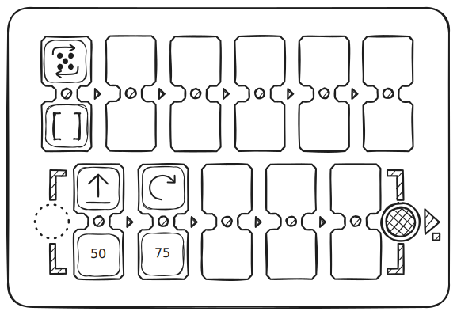
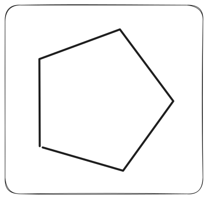
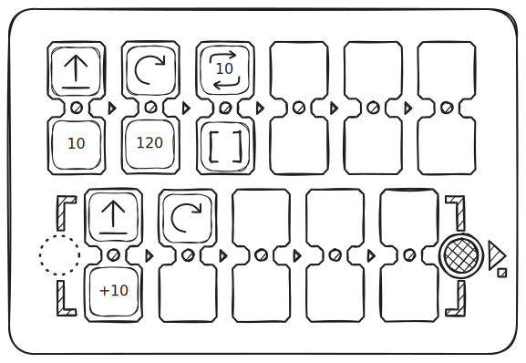

# Exemples de Dessins Mathématiques

## Étoile Simple à Dix Branches

| Code | Résultat |
| --- | --- |
|  |  |

## Pentagone Régulier

| Code | Résultat |
| --- | --- |
|  |  |

## Étoile Simple à Cinq Branches

| Code | Résultat |
| --- | --- |
|  |  |

## Dessin Mathématique d'un Cœur

| Code | Résultat |
| --- | --- |
|  |  |

## Triangle avec un Programme Simple

| Code | Résultat |
| --- | --- |
|  |  |

## Triangle Utilisant une Fonction

| Code | Résultat |
| --- | --- |
|  |  |

## Spirale Triangulaire

| Code | Résultat |
| --- | --- |
|  |  |

## Courbe avec Angles Négatifs

| Code | Résultat |
| --- | --- |
|  |  |

## Spirale Carrée

| Code | Résultat |
| --- | --- |
|  |  |

## Minuteur ~5 Minutes

| Code | Résultat |
| --- | --- |
|  |  |

## Spirale

| Code | Résultat |
| --- | --- |
|  |  |

