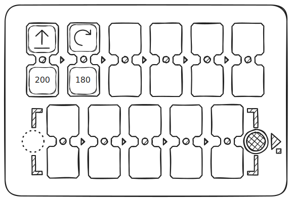

## Игровой процесс - часть 7 (расширенный уровень)

### Знакомство с числами

Без установки цифровых значений к командам (выше или ниже команды) робот использует параметры движения по умолчанию:  
- Шаг вперёд на 10 см (100 мм).  
- Поворот на 90 градусов.  

Можно управлять этими значениями, добавляя цифровые параметры к командам в парные ячейки.  

Пример: Добавьте к команде **"Вперёд"** значение **200** и посмотрите, на какое расстояние проедет робот. Добавьте значение **180** к команде **"поворот"** и оцените изменения.  

> **Важно:** Пульт сохраняет последнее установленное значение для движения и поворота. 
- Если команда используется без указания нового значения, применяется последнее зачение, которое сохраняется в памяти до выключения пульта! 
- Таким образом, установка нового параметра изменяет значение по умолчанию.  
- Исходные значения (100 мм и 90°) можно восстановить, явно указав их в командах или выключив и включив пульт.  

Гибкое управление числами расширяет возможности обучения. Изменяя расстояние и угол поворота, можно:  
- Создавать сложные фигуры.  
- Программировать движение по криволинейной траектории.  
- Реализовывать новые сценарии движения.  

Используйте переменные параметры, чтобы вывести управление роботом на новый уровень. Посмотрите примеры на [странице с математическими рисунками](/ru/math_drawings_ru).

## Игровой процесс - часть 8 (расширенный уровень)

### Знакомство с арифметическими операциями

Числовые значения с арифметическими операциями изменяют значения команд движения. Это позволяет динамически изменять значения команд движения (Вперёд, Назад, Влево, Вправо), делая управление роботом более гибким.

Как это работает?
Когда вы добавляете арифметическую операцию, пульт изменяет сохранённое число для команды движения и отправляет роботу новое значение.

Пример:
Команда "Вперёд 200" заставит робота проехать 200 мм (20 см).
Если следующая команда "Вперёд +100", робот проедет 300 мм (30 см).

Если такие команды используются в цикле, можно создавать последовательности чисел — арифметические и геометрические прогрессии.

> Важный момент: Если команда уменьшает значение и оно становится отрицательным, робот выполнит противоположное действие: 
Вместо движения вперёд — поедет назад.
Вместо поворота влево — повернёт вправо.

Доступные арифметические операции:
- Сложение (+) — увеличивает значение.
- Вычитание (-) — уменьшает значение.
- Умножение (*) — увеличивает число в несколько раз.
- Деление (/) — уменьшает число.
- Корень (√) — извлекает квадратный корень.
- Степень (^) — возводит в указанную степень.

Хотите увидеть, как создаются сложные математические узоры с помощью этих операций? Загляните на [страницу с примерами математических рисунков](/ru/math_drawings_ru)!

## Играйте и учитесь вместе с детьми!

Только вы лучше всего знаете своих учеников и как с ними работать. Только от вас зависит развитие детей и их образование. PrimaSTEM является универсальным инструментом для обучения детей в игровой форме не только логике и программированию, но и другим предметам, используйте его гибкость и универсальность для создания игровой среды. Всё зависит только от вашей фантазии!

*p/s: Спасибо за использование PrimaSTEM в вашем учебном процессе или за проявленный интерес к комплексу!
Мы очень надеемся на обратную связь и отзывы, пожалуйста [напишите нам](/ru/contacts.md) об опыте использования.*